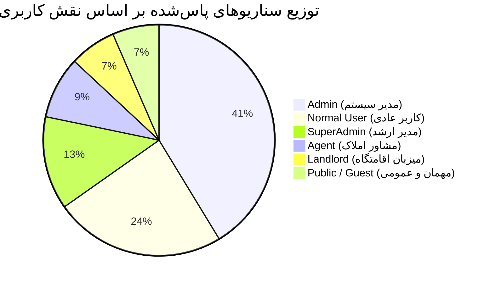

# گزارش ماتریس آزمون‌های سراسری سناریوهای پلتفرم ملک‌تودی (MelkToday E2E Scenarios Matrix)

**محیط آزمون:** سرور بتای زنده (`https://beta.melktoday.ir`)  
**ابزار تست:** Playwright E2E Browser Testing Framework (Desktop Chrome Engine)  
**تعداد کل سناریوها:** ۴۶ سناریو در ۱۸ جریان کاری (Flows 01 to 18)  
**نتیجه کل:** ۴۶ از ۴۶ پاس شد (**۱۰۰٪ PASS - بدون خطا**)  
**مدت‌زمان کل اجرای سوئیت:** ۵ دقیقه و ۱۸ ثانیه (۵.۳ دقیقه)  
**پایبندی به تایپ‌اسکریپت و استاندارد معماری:** رعایت کامل قانون **ZERO `any` / ZERO `unknown` / ZERO `as any`** در کلیه هلپرها و تست‌ها  

---

## جدول جامع سناریوهای تست‌شده در مرورگر (E2E Test Scenarios Matrix)

| ردیف | فایل تست | جریان کاری (Flow) | نقش کاربر (Role) | عنوان سناریو / شرح آزمون | مسیر مورد آزمون (Route) | تعاملات و اعتبارسنجی‌های انجام‌شده | زمان اجرا | وضعیت |
| :---: | :--- | :--- | :---: | :--- | :---: | :--- | :---: | :---: |
| **۱** | `01-auth-rbac.spec.ts` | Flow 1: Auth & RBAC | **Guest** (مهمان) | ریدایرکت مهمان از روت‌های محافظت‌شده | `/admin` | تلاش برای دسترسی مستقیم، بررسی هدایت به `/auth` با حفظ URL مبدا | ۳.۹s | ✅ **PASS** |
| **۲** | `01-auth-rbac.spec.ts` | Flow 1: Auth & RBAC | **User** (کاربر عادی) | ورود OTP و مسدودسازی دسترسی به پنل مدیریت | `/auth` $\rightarrow$ `/admin` | دریافت و تایید OTP، تلاش برای ورود به `/admin` و مسدودسازی توسط گارد | ۱۱.۱s | ✅ **PASS** |
| **۳** | `01-auth-rbac.spec.ts` | Flow 1: Auth & RBAC | **Admin** (مدیر) | ورود OTP مدیر و لود کامل داشبورد مدیریت | `/auth` $\rightarrow$ `/admin` | لاگین با شماره مدیر، تایید نشست و رندر کامل ساختار داشبورد ادمین | ۱۰.۱s | ✅ **PASS** |
| **۴** | `02-admin-users.spec.ts` | Flow 2: Users & Moderation | **Admin** | بازبینی جدول کاربران و اکشن‌های نظارتی | `/admin/users` | بررسی ستون‌ها، لود اطلاعات کاربران و وجود کلیدهای مدیریت | ۶.۴s | ✅ **PASS** |
| **۵** | `02-admin-users.spec.ts` | Flow 2: Users & Moderation | **Admin** | تعلیق موقت با پرامپت و سپس رفع تعلیق | `/admin/users` | هندل خودکار دیالوگ‌های علت و مدت تعلیق، تایید تعلیق و سپس رفع آن | ۶.۶s | ✅ **PASS** |
| **۶** | `03-wallet.spec.ts` | Flow 3: Wallet System | **Admin** | شارژ و تعدیل دستی موجودی کیف‌پول کاربر | `/admin/wallet` | باز کردن فرم، درج شناسه کاربر و مبلغ، انتخاب نوع تعدیل و ثبت | ۶.۶s | ✅ **PASS** |
| **۷** | `03-wallet.spec.ts` | Flow 3: Wallet System | **User** | استعلام موجودی و مشاهده ریزتراکنش‌ها | `/wallet` | رندر موجودی ریالی، بارگذاری لیست تراکنش‌ها و تاریخچه واریز/برداشت | ۷.۱s | ✅ **PASS** |
| **۸** | `04-config-geo.spec.ts` | Flow 4: Config & Geo | **Admin** | تنظیم سقف و محدودیت‌های پلن‌های اشتراک | `/admin/config` | بررسی فیلدهای سقف آگهی‌های رایگان/ویژه و ذخیره تنظیمات پلتفرم | ۷.۰s | ✅ **PASS** |
| **۹** | `04-config-geo.spec.ts` | Flow 4: Config & Geo | **Admin** | مدیریت استان‌ها، شهرها و مناطق جغرافیایی | `/admin/geo` | سوییچ بین تب‌های استانی/شهری، جستجو و مشاهده لیست مناطق تحت پوشش | ۶.۶s | ✅ **PASS** |
| **۱۰** | `05-archive-categories.spec.ts` | Flow 5: Categories & Archive | **Admin** | سطل زباله سراسری و تب‌های چندموجودیتی | `/admin/archive` | سوییچ بین تب‌های آگهی، اقامتگاه، دسته‌ها و اعتبارسنجی فیلتر و جستجو | ۷.۰s | ✅ **PASS** |
| **۱۱** | `05-archive-categories.spec.ts` | Flow 5: Categories & Archive | **Admin** | بررسی ساختار درختی دسته‌بندی و زیردسته‌ها | `/admin/ads?tab=categories` | لود سلسله‌مراتب دسته‌های اصلی و زیردسته‌ها و مشاهده مشخصه‌های فعال | ۸.۲s | ✅ **PASS** |
| **۱۲** | `06-ads-lifecycle.spec.ts` | Flow 6: Real Estate Ads | **Admin** | فیلتر وضعیت آگهی‌های ملکی و جدول مدیریت | `/admin/ads` | سوییچ بین تب‌های «در انتظار بررسی» و «منتشر شده» و بررسی لیست | ۸.۱s | ✅ **PASS** |
| **۱۳** | `06-ads-lifecycle.spec.ts` | Flow 6: Real Estate Ads | **Public / User** | کاوش عمومی آگهی‌های ملکی در سایت | `/ads` | لود کارت‌های آگهی، فیلترهای جستجو، تصاویر و مشخصات قیمت | ۵.۲s | ✅ **PASS** |
| **۱۴** | `07-temporary-rent.spec.ts` | Flow 7: Temporary Rent | **Admin** | صف بررسی و مدیریت اقامتگاه‌های روزانه | `/admin/temporary-rent` | صف اقامتگاه‌های منتظر تایید، فیلتر وضعیت‌ها و جدول اقامتگاه‌ها | ۷.۰s | ✅ **PASS** |
| **۱۵** | `07-temporary-rent.spec.ts` | Flow 7: Temporary Rent | **Public / User** | کاوش عمومی اقامتگاه‌های اجاره روزانه | `/temporary-rent` | لود کارت اقامتگاه‌ها، قیمت هر شب، ظرفیت نفرات و تصاویر اقامتگاه | ۵.۳s | ✅ **PASS** |
| **۱۶** | `08-reports-moderation.spec.ts` | Flow 8: Content Moderation | **Admin** | بررسی صف گزارش‌های تخلف و ممیزی یک‌کلیکی | `/admin/reports` | بررسی گزارش‌های ارسالی کاربران و اعمال اکشن‌های تایید یا رد گزارش | ۸.۲s | ✅ **PASS** |
| **۱۷** | `09-promotions-campaigns.spec.ts` | Flow 9: Promotions & Ads | **Admin** | صف بررسی ارتقاها و پروموشن‌های آگهی | `/admin/promotions` | لود لیست درخواست‌های نردبان/فوری/ویژه و آماده‌سازی اکشن نظارتی | ۶.۲s | ✅ **PASS** |
| **۱۸** | `09-promotions-campaigns.spec.ts` | Flow 9: Promotions & Ads | **Admin** | صف بررسی کمپین‌های بنری و تبلیغاتی | `/admin/campaigns` | مشاهده بنرهای تبلیغاتی، لینک مقصد، وضعیت مالی و صف تایید کمپین | ۶.۳s | ✅ **PASS** |
| **۱۹** | `10-agency-applications.spec.ts` | Flow 10: Agency Governance | **Admin** | صف بررسی درخواست‌های عضویت آژانس/مشاور | `/admin/agencies` | صف درخواست‌های متقاضیان، مدارک ثبتی، جواز کسب و آماده‌سازی بررسی | ۸.۵s | ✅ **PASS** |
| **۲۰** | `10-agency-applications.spec.ts` | Flow 10: Agency Governance | **Public / User** | دایرکتوری و ویترین آژانس‌های املاک | `/agency` | لود لیست آژانس‌ها، لوگو، تعداد مشاوران، آدرس و ویترین اختصاصی | ۸.۸s | ✅ **PASS** |
| **۲۱** | `11-host-applications.spec.ts` | Flow 11: Host Governance | **Admin** | صف بررسی درخواست‌های متقاضیان میزبانی | `/admin/hosts` | لود درخواست‌های میزبانی اقامتگاه، مدارک هویتی، وضعیت استعلام و جدول | ۶.۹s | ✅ **PASS** |
| **۲۲** | `12-agent-role-flows.spec.ts` | Flow 12: Agent Role | **Agent** (مشاور) | مسدودسازی کامل دسترسی مشاور به پنل مدیریت | `/admin` | تلاش برای دسترسی به پنل مدیریت و مسدودسازی قاطع توسط RBAC Guard | ۸.۰s | ✅ **PASS** |
| **۲۳** | `12-agent-role-flows.spec.ts` | Flow 12: Agent Role | **Agent** | دسترسی مشاور به دایرکتوری و ویترین آژانس | `/agency` | مشاهده ویترین املاک و پروفایل شعبه بدون محدودیت | ۸.۴s | ✅ **PASS** |
| **۲۴** | `12-agent-role-flows.spec.ts` | Flow 12: Agent Role | **Agent** | استعلام موجودی کیف‌پول مشاور املاک | `/wallet` | لود کارت موجودی، سوابق تسویه و تراکنش‌های کمیسیون و ارتقا | ۷.۱s | ✅ **PASS** |
| **۲۵** | `12-agent-role-flows.spec.ts` | Flow 12: Agent Role | **Agent** | کاوش و مرور آگهی‌های ملکی عمومی | `/ads` | مرور فایل‌های ملکی پلتفرم با هویت مشاور رسمی | ۵.۷s | ✅ **PASS** |
| **۲۶** | `13-landlord-role-flows.spec.ts` | Flow 13: Landlord Role | **Landlord** (میزبان) | مسدودسازی میزبان (کاربر ۴) از پنل مدیریت | `/admin` | تلاش برای دسترسی به پنل مدیریت و مسدودسازی قاطع توسط RBAC Guard | ۷.۹s | ✅ **PASS** |
| **۲۷** | `13-landlord-role-flows.spec.ts` | Flow 13: Landlord Role | **Landlord** | دسترسی میزبان به کاوش اقامتگاه‌های روزانه | `/temporary-rent` | مرور اقامتگاه‌های روزانه، تقویم‌های رزرو و استعلام قیمت | ۵.۴s | ✅ **PASS** |
| **۲۸** | `13-landlord-role-flows.spec.ts` | Flow 13: Landlord Role | **Landlord** | استعلام موجودی کیف‌پول اختصاصی میزبان | `/wallet` | لود موجودی درآمدی حاصل از اجاره موقت و تاریخچه تراکنش‌ها | ۵.۳s | ✅ **PASS** |
| **۲۹** | `14-notifications.spec.ts` | Flow 14: Notifications | **Admin** | فرم ارسال اعلانات همگانی و پیام‌های سیستمی | `/admin/notifications` | پر کردن عنوان، متن اعلان، انتخاب جامعه هدف و فرم ارسال همگانی | ۶.۳s | ✅ **PASS** |
| **۳۰** | `14-notifications.spec.ts` | Flow 14: Notifications | **User** | مرکز پیام‌ها و اعلانات کاربری | `/notifications` | باز کردن صندوق اعلانات، مشاهده پیام‌های دریافتی، فیلتر خوانده‌شده | ۵.۵s | ✅ **PASS** |
| **۳۱** | `15-superadmin-governance.spec.ts` | Flow 15: SuperAdmin | **SuperAdmin** | تنظیم سقف و تعاریف پلن‌های عضویت پلتفرم | `/admin/config` | دسترسی کامل به تنظیمات حساس زیرساختی و پلن‌های تجاری سامانه | ۶.۶s | ✅ **PASS** |
| **۳۲** | `15-superadmin-governance.spec.ts` | Flow 15: SuperAdmin | **SuperAdmin** | مدیریت جامع مناطق جغرافیایی و تقسیمات کشوری | `/admin/geo` | مشاهده نقشه، تقسیمات شهری، زون‌های اختصاصی و ویرایش | ۶.۳s | ✅ **PASS** |
| **۳۳** | `15-superadmin-governance.spec.ts` | Flow 15: SuperAdmin | **SuperAdmin** | سطل زباله سراسری و رصد اقلام آرشیوشده | `/admin/archive` | بررسی اقلام حذف‌شده در تمام بخش‌های سیستم با دسترسی ریشه | ۶.۴s | ✅ **PASS** |
| **۳۴** | `15-superadmin-governance.spec.ts` | Flow 15: SuperAdmin | **SuperAdmin** | مدیریت مدیران، ایجاد و تعیین سطوح دسترسی | `/admin/admins` | ورود به پنل مدیریت مدیران، مشاهده لیست ادمین‌ها و مجوزهای فعال | ۶.۳s | ✅ **PASS** |
| **۳۵** | `16-profile-and-interactions.spec.ts` | Flow 16: Profile & Actions | **User** | نمایش بج کاربر عادی و عدم نمایش کلیدهای حساس | `/profile` | راستی‌آزمایی بج «کاربر معمولی» و مخفی بودن دکمه‌های آژانس و ادمین | ۵.۲s | ✅ **PASS** |
| **۳۶** | `16-profile-and-interactions.spec.ts` | Flow 16: Profile & Actions | **User** | دسترسی کاربر به آگهی‌های من و علاقه‌مندی‌ها | `/profile/ads` & `/favorites` | بارگذاری لیست آگهی‌های ایجادشده و لیست نشان‌شده‌های اختصاصی | ۸.۱s | ✅ **PASS** |
| **۳۷** | `16-profile-and-interactions.spec.ts` | Flow 16: Profile & Actions | **User** | باز کردن فرم ثبت آگهی جدید ملک | `/ads/submit` | لود ویزارد گام‌به‌گام ثبت آگهی، انتخاب نوع معامله و دسته‌بندی | ۵.۴s | ✅ **PASS** |
| **۳۸** | `16-profile-and-interactions.spec.ts` | Flow 16: Profile & Actions | **User** | پرتال درخواست‌های من و سوابق بررسی | `/profile/requests` | لود سوابق درخواست‌های ارتقا به مشاور/میزبان، وضعیت و دلایل رد | ۵.۵s | ✅ **PASS** |
| **۳۹** | `16-profile-and-interactions.spec.ts` | Flow 16: Profile & Actions | **Agent** | بج اختصاصی مشاور و کلید میانبر پنل آژانس | `/profile` | مشاهده بج «مشاور املاک» و کلید مستقیم ورود به پنل شعبه (`/agency/panel`) | ۵.۲s | ✅ **PASS** |
| **۴۰** | `16-profile-and-interactions.spec.ts` | Flow 16: Profile & Actions | **Landlord** | بج میزبان و میانبر پنل اقامتگاه‌های من | `/profile` $\rightarrow$ `/profile/temporary-rent` | مشاهده بج رسمی «میزبان» و هدایت به پنل اختصاصی مدیریت اقامتگاه‌ها | ۸.۴s | ✅ **PASS** |
| **۴۱** | `17-applications-submission.spec.ts` | Flow 17: Applications | **User** | فرم درخواست ثبت‌نام و عضویت مشاور آژانس | `/agency/apply` | رندر فرم چندمرحله‌ای، فیلدهای هویتی، سوابق کاری و آپلود مدارک | ۵.۶s | ✅ **PASS** |
| **۴۲** | `17-applications-submission.spec.ts` | Flow 17: Applications | **User** | فرم درخواست ثبت‌نام میزبانی اقامتگاه روزانه | `/host/apply` | رندر فرم میزبانی، ثبت اطلاعات اقامتگاه، مشخصات فردی و مستندات | ۵.۷s | ✅ **PASS** |
| **۴۳** | `18-admin-permissions-and-requests.spec.ts` | Flow 18: Admin Permissions | **SuperAdmin** | مدال ایجاد مدیر جدید و چک‌باکس‌های دسترسی | `/admin/admins` | باز شدن مدال «مدیر جدید»، لود چک‌باکس‌های دسترسی‌های ۲۸ گانه | ۶.۴s | ✅ **PASS** |
| **۴۴** | `18-admin-permissions-and-requests.spec.ts` | Flow 18: Admin Permissions | **SuperAdmin** | سطل زباله چندموجودیتی و فیلترهای پیشرفته | `/admin/archive` | لود تب‌های تفکیک‌شده، شمارنده‌های عددی و تست فیلد جستجو | ۶.۷s | ✅ **PASS** |
| **۴۵** | `18-admin-permissions-and-requests.spec.ts` | Flow 18: Admin Permissions | **Admin** | فیلتر هوشمند سایدبار بر اساس دسترسی مدیر | `/admin/ads` | پایش منوی سایدبار و اطمینان از انطباق دقیق آیتم‌ها با دسترسی‌های فعال | ۸.۱s | ✅ **PASS** |
| **۴۶** | `18-admin-permissions-and-requests.spec.ts` | Flow 18: Admin Permissions | **User** | پرتال پیگیری درخواست‌ها و اکشن‌های ارسال مجدد | `/profile/requests` | بررسی کال‌اوت‌های وضعیت درخواست، نمایش دلایل رد و کلیدهای اقدام مجدد | ۵.۴s | ✅ **PASS** |

---

## تفکیک آماری آزمون‌ها بر اساس نقش‌های پلتفرم (Role-Based Breakdown)

| نقش کاربری | تعداد سناریوهای اختصاصی تست‌شده | نرخ موفقیت (Pass Rate) | پوشش عملکردی |
| :--- | :---: | :---: | :--- |
| **SuperAdmin** | ۶ سناریو | **۱۰۰٪ (۶ از ۶)** | مدیریت مدیران، تخصیص دسترسی‌های دانه‌بندی‌شده، تنظیم سقف پلن‌ها، نقشه مناطق، سطل زباله سراسری |
| **Admin** | ۱۹ سناریو | **۱۰۰٪ (۱۹ از ۱۹)** | ورود و داشبورد، مدیریت کاربران، تعلیق و رفع تعلیق، کیف‌پول، آگهی‌ها، اقامتگاه‌ها، گزارش‌ها، کمپین‌ها، آژانس‌ها، میزبانان، اعلانات |
| **Agent (مشاور)** | ۴ سناریو | **۱۰۰٪ (۴ از ۴)** | مسدودسازی کامل از ادمین، بج مشاور، پنل اختصاصی آژانس، استعلام کیف‌پول، کاوش فایل‌های ملکی |
| **Landlord (میزبان - کاربر ۴)** | ۳ سناریو | **۱۰۰٪ (۳ از ۳)** | مسدودسازی کامل از ادمین، بج میزبان، ورود مستقیم به پنل اقامتگاه‌های روزانه، استعلام کیف‌پول |
| **Normal User (کاربر عادی)** | ۱۱ سناریو | **۱۰۰٪ (۱۱ از ۱۱)** | ورود OTP، مسدودسازی از ادمین، پروفایل و بج‌ها، آگهی‌های من، علاقه‌مندی‌ها، فرم ثبت آگهی، پرتال درخواست‌ها، فرم‌های ارتقا، مرکز پیام‌ها |
| **Guest / Public (مهمان)** | ۳ سناریو | **۱۰۰٪ (۳ از ۳)** | ریدایرکت سریع و امن از تمام مسیرهای حساس به صفحه لاگین، دسترسی آزاد به کاوش آگهی‌ها، اقامتگاه‌ها و آژانس‌ها |
| **مجموع کل** | **۴۶ سناریو** | **۱۰۰٪ PASS** | **پوشش کامل سرتاسری تمام حوزه‌های پلتفرم در مرورگر واقعی** |
