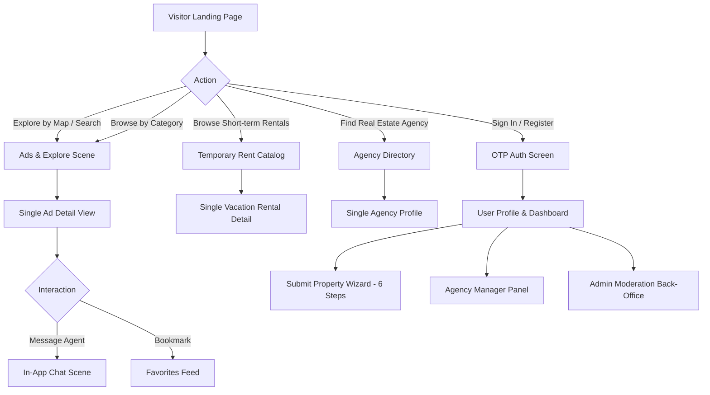
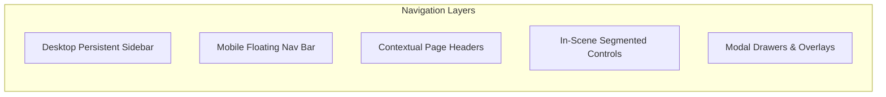

# Melktoday Front-V2: Product Design, System Architecture & Technical Specification

> **Target Audience:** Product Designers, UI/UX Specialists, Frontend Engineers, and Product Managers  
> **Platform:** Melktoday Real Estate & Short-term Rental Platform (`Front-V2`)  
> **Language / Directionality:** Persian (`fa`) / Right-to-Left (`dir="rtl"`)  
> **Core Framework:** Next.js 16 (App Router), React 19, TypeScript 6, Tailwind CSS v4  

---

## 1. Executive Summary & Platform Identity

**Melktoday** is a modern real estate and short-term property rental platform engineered specifically for the Iranian market. The platform addresses four core user personas:
1. **Tenants / Buyers (Regular Users):** Search, filter, map-browse properties, bookmark favorites, chat with agents, and book short-term rentals.
2. **Property Owners / Landlords:** Create drafts, publish regular sale/rent ads and temporary/nightly rental accommodations, upload multimedia, and track engagement.
3. **Real Estate Agencies & Agents:** Dedicated agency profiles, consultant rosters, lead capture via consultations, and an agency management dashboard.
4. **Platform Administrators & Moderators:** Review and moderate property listings, manage user statuses (ban/suspend), resolve community abuse reports, configure geo-hierarchies (provinces/cities/zones), manage category structures, adjust user wallets, and broadcast platform notifications.

The user experience is built entirely around an **RTL-first (Right-to-Left)** mental model, using Persian typography (**Vazirmatn**), local numbering conventions (Persian digits via `Intl.NumberFormat('fa-IR')`), and local geo-administrative units (Provinces, Cities, Municipal Districts, and Neighborhoods).

---

## 2. Codebase Architecture & File Structure

The frontend is structured around a **Scene-Driven Architecture** combined with Next.js 16 App Router. Rather than co-locating complex UI logic inside `app/[route]/page.tsx`, the repository decouples routing from presentation:
- **`app/`**: Next.js App Router layer; contains routing definitions, layout shells, metadata, and lightweight wrapper pages that delegate rendering to scenes.
- **`scenes/`**: Presentation and screen container layer; contains the business logic, UI assembly, local state, and data hook orchestration for each major screen.
- **`components/`**: Reusable component ecosystem separated into primitives (`components/ui`), domain features (`components/chat`), layout shells (`components/layout`), and context providers (`components/providers`).
- **`services/`**: Pure API communication layer; wraps Axios network calls into strongly-typed domain services.
- **`hooks/`**: TanStack React Query hooks; encapsulates caching, server-state mutations, optimistic updates, and infinite scrolling.
- **`types/`**: Shared TypeScript definitions, data contracts, request/response DTOs, and RBAC permissions.
- **`lib/`**: Core utilities, Axios interceptor configuration, token refresh logic, and error handlers.
- **`assets/`**: Local imagery, static branding, and authentication visual assets.

### Complete Directory Layout

```
melktoday-front-v2/
├── app/                                # Next.js 16 App Router
│   ├── layout.tsx                      # Root Shell: RTL setup, Font, Providers, Sidebar, MobileNav, Toaster
│   ├── globals.css                     # Tailwind v4 @theme inline tokens, typography, utilities
│   ├── page.tsx                        # Home route -> mounts HomeScene
│   ├── auth/                           # Authentication route (OTP Phone & Verification)
│   ├── ads/                            # Listings Catalog & Single Listing routes
│   │   ├── page.tsx                    # Ads list view -> mounts AdsScene
│   │   ├── [id]/[[...title]]/page.tsx  # Dynamic SEO listing detail -> mounts SingleAdScene
│   │   └── submit/                     # Ad submission multi-step flow -> mounts SubmitAdScene
│   ├── explore/                        # Map-first exploration route -> mounts AdsScene (viewMode="map")
│   ├── temporary-rent/                 # Short-term / vacation rental catalog
│   │   ├── page.tsx                    # Temporary rentals list -> mounts TemporaryRentScene
│   │   └── [id]/[[...title]]/page.tsx  # Temporary rental detail -> mounts ResidenceDetailScene
│   ├── agency/                         # Real Estate Agency Directory & Profiles
│   │   ├── page.tsx                    # Agency list -> mounts AgencyScene
│   │   ├── [id]/[[...title]]/page.tsx  # Agency public profile -> mounts SingleAgencyScene
│   │   ├── create/                     # Agency onboarding form
│   │   └── panel/                      # Agency Manager Dashboard (Stats, Settings)
│   ├── favorites/                      # User Bookmarks and Interaction History
│   ├── profile/                        # User Dashboard, Profile Edit, Wallet Balance
│   │   ├── page.tsx                    # Profile overview -> mounts ProfileScene
│   │   ├── ads/                        # User's own ads management (Drafts, Published, Submit for Review)
│   │   ├── temporary-rent/             # User's short-term rental management
│   │   │   ├── page.tsx                # List of user's temporary rentals
│   │   │   └── new/                    # Create temporary rental ad
│   │   └── chat/                       # User messaging inbox -> mounts ChatScene
│   └── admin/                          # Administrative Back-Office Panel
│       ├── layout.tsx                  # Admin Shell: AccessGuard, Admin Sidebar, Topbar
│       ├── page.tsx                    # System overview dashboard & metrics
│       ├── ads/                        # Property listing moderation (Approve/Reject)
│       ├── users/                      # User moderation (Ban/Suspend/Reinstate)
│       ├── wallet/                     # Financial operations & credit adjustments
│       ├── promotions/                 # Listing promotion review (Ladder, Pin, Urgency)
│       ├── campaigns/                  # Ad campaigns approval
│       ├── geo/                        # Geographic zones & KML import
│       ├── categories/                 # Category & subcategory taxonomy management
│       ├── reports/                    # User abuse reports moderation
│       ├── notifications/              # Broadcast push/SMS notifications
│       └── config/                     # Subscription plan limits & capabilities
├── scenes/                             # Screen Container Layer (Presentation & Flow)
│   ├── home/index.tsx                  # Home screen layout: hero, city filter, featured, agencies, daily rent
│   ├── ads/index.tsx                   # Search screen: split-view (listing grid + Leaflet map)
│   ├── single-add/index.tsx            # Property detail view: media gallery, 360 preview, facilities, contact
│   ├── submit-ad/index.tsx             # 6-step property submission wizard
│   ├── temporary-rent/index.tsx        # Vacation rental directory
│   ├── single-temporary-rent/index.tsx # Vacation rental detail view with reviews
│   ├── agency/                         # Agency screens (Directory, Single Agency, Create, Panel)
│   ├── chat/index.tsx                  # Real-time messaging split view (Conversation List + Chat Window)
│   └── profile/                        # User profile, ads list, temporary rentals management
├── components/                         # Design System & UI Components
│   ├── ui/                             # Atomic & Molecular Design System primitives
│   │   ├── Button.tsx                  # CVA-powered button with 6 variants and 4 sizes
│   │   ├── Badge.tsx                   # Tag/Pill component with 4 status variants
│   │   ├── PropertyCard.tsx            # Property card (Vertical grid & Horizontal feed variants)
│   │   ├── AgencyCard.tsx              # Agency card with verification badge and rating
│   │   ├── Map.tsx                     # Interactive Leaflet map with custom HTML price bubble pins
│   │   ├── MapPicker.tsx               # Leaflet map picker for pinning coordinates during listing submission
│   │   ├── Slider.tsx                  # Swiper.js touch slider wrapper
│   │   ├── StatusStates.tsx            # Standardized ErrorState (with retry) and EmptyState
│   │   ├── ReviewsSection.tsx          # Rating breakdown & user review feed
│   │   ├── ReviewStars.tsx             # Interactive and display 5-star rating component
│   │   ├── ReviewItem.tsx              # Single user review card
│   │   └── ReviewForm.tsx              # User review submission modal/form
│   ├── layout/                         # Structural UI
│   │   └── Navigation.tsx              # Desktop persistent Sidebar + Mobile bottom navigation bar
│   ├── chat/                           # Chat UI components
│   │   ├── ChatHeader.tsx              # Chat screen top bar
│   │   ├── ConversationList.tsx        # Conversation thread drawer/list
│   │   └── ChatWindow.tsx              # Message timeline, chat input, and media attachment
│   ├── providers/                      # Context Providers
│   │   ├── CityProvider.tsx            # Global city selection context with localStorage persistence
│   │   └── QueryProvider.tsx           # TanStack React Query client provider with retry policies
│   ├── AccessGuard.tsx                 # Route-level RBAC guard with redirect logic
│   ├── RoleGuard.tsx                   # Inline component-level role permission visibility guard
│   ├── CitySelector.tsx                # Bottom-sheet/modal for city selection with infinite search
│   ├── SearchHeader.tsx                # Hero search bar, city indicator, and live search suggestions
│   ├── PageHeader.tsx                  # Generic page title, search filter, and city badge
│   ├── CategoryFilter.tsx              # Horizontal category icon slider
│   ├── SectionHeader.tsx               # Section title, subtitle, and "view all" link
│   └── AgentAvatar.tsx                 # Real estate agent circular avatar card
├── services/                           # API Layer (Axios Endpoint Mappings)
│   ├── auth.service.ts                 # Phone OTP, token refresh, role switching, session termination
│   ├── ads.service.ts                  # Property listings CRUD, draft, review submission, categories
│   ├── search.service.ts               # Search queries, auto-suggestions, city/neighborhood lookups
│   ├── agency.service.ts               # Agency directory, profile, follow/unfollow, consultations
│   ├── temporary-rent.service.ts       # Short-term accommodation ads, drafts, publish
│   ├── reviews.service.ts              # Reviews submission and rating stats for agencies & rentals
│   ├── chat.service.ts                 # Conversation threads, messaging, unread counts
│   ├── favorites.service.ts            # Saved listings and user activity bookmarks
│   ├── user.service.ts                 # Profile management, KYC verification, roles lookup
│   ├── wallet.service.ts               # Balance lookup, transactions list, credit top-up
│   ├── geo.service.ts                  # Geo hierarchy (Provinces, Cities, Zones, Neighborhoods)
│   ├── admin.service.ts                # Admin moderation (ads, users, wallet, geo, categories, reports)
│   └── media.service.ts                # S3 pre-signed upload URL generation, direct upload, confirm
├── hooks/                              # React Query Hooks Layer (Caching, Mutating, Infinite Query)
│   ├── useAuth.ts                      # Session state, JWT decode, permissions, login/logout
│   ├── useAds.ts                       # Listings queries, category queries, listing mutation
│   ├── useSearch.ts                    # Search queries and debounced suggestion hook
│   ├── useAgencies.ts                  # Agency list, single agency, follow/unfollow mutations
│   ├── useTemporaryRent.ts             # Temporary rentals queries and mutations
│   ├── useChat.ts                      # Conversation list, message history, send message mutation
│   ├── useFavorites.ts                 # Bookmarks retrieval and toggle mutation
│   ├── useUser.ts                      # User profile fetching and updating
│   ├── useWallet.ts                    # Wallet balance, transactions query, charge mutation
│   ├── useGeo.ts                       # Geo zone query hooks
│   ├── useGeoHierarchy.ts              # Infinite hierarchical province-city loading hook
│   ├── useAdmin.ts                     # Admin operations queries and mutations
│   ├── useMedia.ts                     # Multi-step S3 media upload mutation
│   └── usePermission.ts                # Permission verification helper
├── types/                              # TypeScript Data Contracts
│   ├── common.ts                       # Generic JSON and utility types
│   ├── access.ts                       # RBAC definitions (RoleName, Permission, ROLE_PERMISSIONS)
│   └── api/                            # Backend API DTOs (auth, ads, agency, search, temporary-rent, etc.)
├── assets/                             # Static visual assets
│   ├── auth/                           # Four curated real-estate showcase images for auth screen
│   └── index.ts                        # Asset barrel exports
└── lib/                                # Utilities & Network Core
    ├── utils.ts                        # `cn` (clsx + tailwind-merge), `formatCurrency` (Intl fa-IR)
    └── api/
        ├── client.ts                   # Axios instance, Bearer token injection, CSRF handling, 401 refresh queue
        └── error-handler.ts            # Unified backend API error normalizer
```

---

## 3. Design System & Visual Specification

The design system in Melktoday Front-V2 is configured using **Tailwind CSS v4**'s `@theme inline` mechanism in `app/globals.css`.

### 3.1 Design Tokens & Color Palette

```css
@theme inline {
  --font-vazirmatn: var(--font-vazirmatn);

  /* Brand Colors */
  --color-primary: #8BC83F;      /* Vibrant Lime Green - Primary Action, CTAs, Highlights */
  --color-brand: #252B5C;        /* Deep Navy Blue - Headings, Primary Typography, Brand Identity */
  --color-secondary: #53587A;    /* Slate Gray / Muted Navy - Secondary Typography, Icons, Subtitles */

  /* Backgrounds & Borders */
  --color-soft-bg: #F5F4F8;      /* Soft Light Gray / Lavender tint - Card backgrounds, Input fields */
  --color-soft-border: #ECEDF3;  /* Subtle divider border - Card outlines, Separators */

  /* Text Semantics */
  --color-text-main: #252B5C;    /* Main reading text */
  --color-text-light: #53587A;   /* Secondary/Caption text */

  /* Geometry & Radius */
  --radius-button: 10px;         /* Standard rounded-button radius */
}
```

#### Color Meaning & Application
| Token | Hex Value | Role in Product Design |
| :--- | :--- | :--- |
| `--color-primary` | `#8BC83F` | High-emphasis interactive elements, call-to-action buttons, active navigation indicators, price highlight tags, verified badges. |
| `--color-brand` | `#252B5C` | Visual anchor for typography, heavy headings (`font-black`), platform logo, dark action pills, map price pins. |
| `--color-secondary`| `#53587A` | Sub-labels, metadata icons (bed, bath, location pin), inactive states, helper descriptions. |
| `--color-soft-bg` | `#F5F4F8` | Page background accents, input container fills, chips, inactive tab pills, skeleton placeholders. |
| `--color-soft-border`| `#ECEDF3` | Non-intrusive container borders, search bar outlines, table dividers. |
| Status: Red | `#EF4444` | Favorite heart button active state, unread notification dots, error badges, listing rejection. |
| Status: Amber | `#F59E0B` | Review rating stars (`Star fill-yellow-400`), pending approval states. |
| Status: Green | `#22C55E` | System operational indicators, published listing status chips. |

---

### 3.2 Typography System

- **Primary Font Family:** `Vazirmatn` (loaded via `next/font/google` in `app/layout.tsx`).
- **Subsets:** `["arabic", "latin"]` with CSS variable `--font-vazirmatn`.
- **Directionality:** Strict Right-to-Left (`<html lang="fa" dir="rtl">`).
- **Typographic Scale:**
  - **Hero / Display:** `text-3xl` to `text-4xl` (28px–36px), `font-black`, leading tight.
  - **Section Headings:** `text-xl` to `text-2xl` (20px–24px), `font-black text-brand`.
  - **Card Titles:** `text-sm` to `text-base` (14px–16px), `font-bold text-brand`.
  - **Body / Captions:** `text-xs` to `text-sm` (12px–14px), `font-medium text-secondary`.
  - **Micro Metadata / Badges:** `text-[9px]` to `text-[11px]`, `font-bold`.
- **Number Formatting:** Persian numerals rendered via `new Intl.NumberFormat("fa-IR").format(amount)`. Currency displays are formatted with local conventions (e.g., `میلیارد` for billions, `میلیون` for millions, or standard commas).

---

### 3.3 Spatial Layout & Shell Structure

```
+-----------------------------------------------------------------------------------+
|  DESKTOP VIEWPORT (>= 1024px)                                                     |
| +-------------------+-----------------------------------------------------------+ |
| | SIDEBAR (w-64)    | MAIN CONTENT AREA (flex-1, max-w-screen-2xl mx-auto)       | |
| | Sticky h-screen   |                                                           | |
| | - Logo: MELKTODAY | [Page Header / SearchHeader / Dynamic Scenes]             | |
| | - Nav Items (6)   |                                                           | |
| | - Admin Link (RBAC|                                                           | |
| | - Support Card    |                                                           | |
| +-------------------+-----------------------------------------------------------+ |
+-----------------------------------------------------------------------------------+
|  MOBILE VIEWPORT (< 1024px)                                                       |
| +-------------------------------------------------------------------------------+ |
| | Top Content (Full Width, p-4 to p-6, pb-36 for clearance)                     | |
| | [Hero / Filters / Feed / Map Toggle]                                          | |
| |                                                                               | |
| | Floating Mobile Nav (fixed bottom-6 left-6 right-6, h-18, backdrop-blur-xl)  | |
| | [Home]      [Explore]      [Agency]      [Feed/Favorites]      [Profile/Auth] | |
| +-------------------------------------------------------------------------------+ |
```

#### Responsive Shell Rules:
1. **Desktop Shell (`lg:` breakpoint):**
   - Left side contains a persistent vertical sidebar (`w-64 bg-white border-l border-soft-border h-screen sticky top-0 p-6`).
   - Main container features an off-white outer background (`bg-soft-bg/30`) with a white inner card container centered up to `max-w-screen-2xl`.
   - Layout breakouts: using `:has(.chat-page-content)` and `:has(.admin-layout)` in `app/layout.tsx`, chat and admin views expand to 100% viewport width without padding.
2. **Mobile Shell (`< 1024px`):**
   - The desktop sidebar is hidden (`hidden lg:flex`).
   - Bottom floating navigation bar (`MobileNav`) sits fixed at `bottom-6 left-6 right-6` with `h-18`, pill shape (`rounded-full`), white translucent background (`bg-white/80 backdrop-blur-xl`), subtle border, and elevation shadow.
   - Screen content accounts for the floating bottom navigation with a generous bottom padding (`pb-24` or `pb-36`).
3. **Chat & Admin Exclusions:** Both `Sidebar` and `MobileNav` conditionally unmount when viewing `/profile/chat` or any `/admin/*` path.

---

### 3.4 Mobile Bottom Navigation Bar (`MobileNav` Deep Dive)

The mobile bottom navigation is implemented in `components/layout/Navigation.tsx`.

#### Visual Anatomy & Positioning
- **Positioning:** `fixed bottom-6 left-6 right-6 z-50` (floating card design, 24px margin from screen edges).
- **Dimensions:** Fixed height of `72px` (`h-18`).
- **Materials & Aesthetics:** `bg-white/80 backdrop-blur-xl border border-white/20 rounded-full shadow-2xl shadow-brand/5`.
- **Exclusion Rules:** Conditionally renders `null` if the route includes `/profile/chat` or starts with `/admin`.

#### The 5 Navigation Items
```
+-----------------------------------------------------------------------------+
|    [ (Home) ]      [ (Explore) ]    [ (Agency) ]    [ (Favs) ]    [ (User) ] |
+-----------------------------------------------------------------------------+
```

| Order | Icon (`lucide-react`) | Route (`href`) | Tooltip / Label | Active Visual State | Inactive Visual State |
| :---: | :--- | :--- | :--- | :--- | :--- |
| **1** | `<Home className="w-6 h-6" />` | `/` | خانه (Home) | `bg-primary text-white shadow-lg shadow-primary/30 w-12 h-12 rounded-full` | `text-secondary w-12 h-12 rounded-full` |
| **2** | `<MapPin className="w-6 h-6" />` | `/explore` | کاوش (Map Explore) | `bg-primary text-white shadow-lg shadow-primary/30 w-12 h-12 rounded-full` | `text-secondary w-12 h-12 rounded-full` |
| **3** | `<Building2 className="w-6 h-6" />` | `/agency` | آژانس‌ها (Agencies) | `bg-primary text-white shadow-lg shadow-primary/30 w-12 h-12 rounded-full` | `text-secondary w-12 h-12 rounded-full` |
| **4** | `<Heart className="w-6 h-6" />` | `/favorites` | فید و نشان‌ها (Favorites) | `bg-primary text-white shadow-lg shadow-primary/30 w-12 h-12 rounded-full` | `text-secondary w-12 h-12 rounded-full` |
| **5** | `<User className="w-6 h-6" />` | Dynamic: `isLoggedIn ? "/profile" : "/auth"` | پروفایل یا ورود (Profile/Auth) | `bg-primary text-white shadow-lg shadow-primary/30 w-12 h-12 rounded-full` | `text-secondary w-12 h-12 rounded-full` |

---

### 3.5 Core Component Library (Design System)

#### 1. Button (`components/ui/Button.tsx`)
Configured using `class-variance-authority` (CVA).
- **Base Styles:** `inline-flex items-center justify-center whitespace-nowrap rounded-button text-sm font-bold transition-all disabled:pointer-events-none disabled:opacity-50 active:scale-95`.
- **Variants:**
  - `primary`: `bg-primary text-white hover:bg-primary/90 shadow-md`
  - `brand`: `bg-brand text-white hover:bg-brand/90 shadow-md`
  - `secondary`: `bg-white text-secondary border border-soft-border hover:bg-soft-bg shadow-sm`
  - `outline`: `border-2 border-primary text-primary bg-transparent hover:bg-primary/5`
  - `ghost`: `hover:bg-soft-bg text-secondary`
  - `link`: `text-primary underline-offset-4 hover:underline`
- **Sizes:**
  - `default`: `h-[50px] px-8 py-4`
  - `sm`: `h-9 px-3`
  - `lg`: `h-12 px-8`
  - `icon`: `h-10 w-10 rounded-full`

#### 2. Badge (`components/ui/Badge.tsx`)
- **Base Styles:** `inline-flex items-center rounded-lg border px-2.5 py-0.5 text-xs font-bold transition-colors`.
- **Variants:**
  - `default`: `border-transparent bg-primary/10 text-primary`
  - `brand`: `border-transparent bg-brand/10 text-brand`
  - `secondary`: `border-transparent bg-secondary/10 text-secondary`
  - `outline`: `text-text-main border-soft-border`

#### 3. PropertyCard (`components/ui/PropertyCard.tsx`)
Primary card primitive for rendering real estate ads. Supports two layouts:
- **`variant="vertical"` (Default):**
  - Image container with aspect ratio `4/3`, rounded corners (`rounded-xl`), overflow hidden.
  - Hover micro-interaction: smooth image scale (`group-hover:scale-110 transition-transform duration-500`).
  - Overlay elements: Favorite Heart button at top-left corner (`backdrop-blur-md`, changes to red filled state upon saving), Category tag badge at bottom-right corner.
  - Content footer: Title line clamp, 5-star rating score, location pin, price with bold unit typography.
- **`variant="horizontal"` (Compact / Favorites Feed):**
  - Side thumbnail (`w-20 h-20` on mobile, `w-24 h-24` on desktop).
  - Horizontal flexbox layout, ideal for lists, notifications, and dense feeds.
- **Automatic Slug Generation:** If `href` is not explicitly passed, generates `/ads/{adId}/{slug}` where title spaces and slashes are hyphen-separated.

#### 4. AgencyCard (`components/ui/AgencyCard.tsx`)
- Rounded card (`rounded-2xl p-4 border border-soft-border hover:shadow-lg transition-all`).
- Features agency logo avatar (`w-12 h-12 lg:w-14 lg:h-14 rounded-xl`), verified badge (`Verified text-primary`), star rating, location, and 2-line clamped bio.

#### 5. Map & MapPicker (`components/ui/Map.tsx` & `components/ui/MapPicker.tsx`)
- Powered by Leaflet (`leaflet` and `react-leaflet`) with OpenStreetMap tiles.
- Client-side dynamic import (`next/dynamic`) with SSR disabled to prevent hydration issues.
- **Custom Price Tag Pin (`createPriceIcon`):** Converts real estate pricing into a custom HTML marker pin with a pill balloon displaying price text (e.g. `۲.۵ میلیارد` or `۹۵۰ میلیون`), a tail dot, and interactive zoom/hover transitions.
- Clicking any pin opens a Leaflet Popup embedding the full `PropertyCard` component.
- `MapPicker` provides interactive pin-dropping with reverse coordinate synchronization during ad submission.

#### 6. Slider (`components/ui/Slider.tsx`)
- Swiper.js wrapper utilizing `FreeMode` and `Pagination` modules.
- Supports smooth horizontal drag and touch swipes on mobile.
- `slidesPerView="auto"` allows dynamic pill/card widths without forced clipping.

#### 7. StatusStates (`components/ui/StatusStates.tsx`)
- **`ErrorState`:** Red alert icon, descriptive error message, and a "Retry" button linked to TanStack Query `refetch()`.
- **`EmptyState`:** Dashed border, light gray background, friendly fallback messaging.

#### 8. Reviews System (`ReviewsSection.tsx`, `ReviewStars.tsx`, `ReviewItem.tsx`, `ReviewForm.tsx`)
- Displays aggregated rating scores, star breakdown, individual author comments, and verified review timestamps.
- Review submission modal allows selecting 1–5 stars and submitting comments for agencies and short-term rentals.

#### 9. CitySelector (`components/CitySelector.tsx`)
- Modal/Drawer with infinite scroll geo-hierarchy.
- Features a debounced search input (300ms delay).
- Groups results by Province, highlights provincial capitals (`مرکز استان`), and persists selected city in `localStorage` through `CityProvider`.

---

## 4. Platform User Journeys & Screen Specifications



### 4.1 Landing Page Architecture: Exact Section Hierarchy

The home page (`scenes/home/index.tsx`) follows an intentional sequential discovery hierarchy designed to take the user from high-level geographic positioning down to hyper-local listings.

```
===================================================================================
SECTION 1: SearchHeader (Top Bar & Hero Search)
- Location trigger (Selected City pill) -> Opens CitySelector modal
- Header Action: Notification bell (if logged in) OR "ورود / ثبت‌نام" button
- Hero Headline: "اینجا، داستان خانه شما آغاز می‌شود"
- Live Search input with debounced auto-complete suggestions dropdown
-----------------------------------------------------------------------------------
SECTION 2: Browse by Regions (جستجو در [نام شهر])
- SectionHeader: Title ("جستجو در تهران"), Subtitle ("مشاهده آگهی‌ها به تفکیک محله")
- Horizontal pill slider of neighborhoods/zones (Swiper)
- Links directly to `/explore?cityName=...&neighbourhoodName=...`
-----------------------------------------------------------------------------------
SECTION 3: Categories (دسته‌بندی‌های املاک)
- CategoryFilter horizontal slider
- Category cards: 16x16 icon container + Persian label (مسکونی، تجاری، اداری، زمین)
- Shimmer skeletons while categories load
-----------------------------------------------------------------------------------
SECTION 4: Featured Properties (املاک ویژه)
- SectionHeader: Title ("املاک ویژه"), Subtitle ("منتخب آگهی‌های برتر"), Link to `/explore?isFeatured=true`
- Horizontal Swiper slider of `PropertyCard` (w-160px on mobile, w-200px on desktop)
- Displays rating, price in Tomans, and favorite heart toggle
-----------------------------------------------------------------------------------
SECTION 5: Top Agencies (آژانس‌های برتر)
- SectionHeader: Title ("آژانس‌های برتر"), Subtitle ("همکاری با بهترین متخصصان"), Link to `/agency`
- Horizontal Swiper slider of circular agency avatars (`AgentAvatar`)
-----------------------------------------------------------------------------------
SECTION 6: Temporary Rentals (اجاره روزانه و اقامتگاه)
- Highlighted section container: `bg-orange-50/20 py-8 rounded-2xl`
- SectionHeader: Title ("اجاره روزانه"), Subtitle ("بهترین گزینه‌ها برای سفرهای کوتاه"), Link to `/temporary-rent`
- Horizontal Swiper slider of `PropertyCard` with nightly pricing (`/شب`)
-----------------------------------------------------------------------------------
SECTION 7: Latest Listings (تازه ترین‌ها)
- SectionHeader: Title ("تازه ترین‌ها"), Subtitle ("جدیدترین آگهی‌های منطقه شما"), Link to `/explore`
- Horizontal Swiper slider of newly published regular property ads
===================================================================================
BOTTOM CLEARANCE: pb-36 (Provides space so floating MobileNav does not obscure content)
```

---

### 4.2 Discovery & Exploration Flow (`/ads`, `/explore`)
- **Dual View Engine (`scenes/ads/index.tsx`):**
  - **Desktop (`>= 1024px`):** Split-screen layout. Left side displays a 2-column scrollable grid of `PropertyCard` items (`flex-1`); right side displays an interactive full-height Leaflet Map (`flex-[1.5]`) with dynamic price markers.
  - **Mobile (`< 1024px`):** Fullscreen view with a floating bottom toggle button (`مشاهده روی نقشه` / `مشاهده آگهی‌ها`) positioned at `bottom-24 left-1/2 -translate-x-1/2` to switch between the listing grid and the map.
- Route `/explore` activates map view by default, while `/ads` defaults to list view.

---

### 4.3 Property Ad Creation: User Access & UX Critique

#### How Users Currently Access Ad Creation in Codebase
In the current implementation, there are **three primary access points** to the ad creation flows:

1. **Via User Profile (`/profile` -> `/profile/ads`):**
   - User taps the **User** icon in the Bottom Nav (or sidebar on desktop).
   - In `/profile`, the user selects the **«آگهی‌های من» (My Ads)** button (`/profile/ads`).
   - If the user has zero ads, an empty state renders with a prominent CTA button: **«ثبت آگهی جدید»**, which routes to the creation wizard at `/ads/submit`.
   - Existing ads have an edit button leading to `/submit-ad?edit={adId}`.
2. **Via Agency Manager Panel (`/agency/panel`):**
   - For users with the `Agent` role, the profile displays **«مدیریت آژانس من»**.
   - Inside the agency panel dashboard, a highlighted callout card provides a direct CTA button: **«ثبت آگهی جدید»**, triggering `router.push('/ads/submit')`.
3. **Via Temporary Rental Panel (`/profile` -> `/profile/temporary-rent`):**
   - For hosts/landlords, `/profile` provides **«پنل اجاره موقت»**.
   - Inside, the user can create short-term listings via `/profile/temporary-rent/new`.

#### UX Critique & Designer Recommendation for Product Designer
> [!IMPORTANT]
> **Key Finding for Product Designer:**  
> Currently, there is **no persistent global CTA** (such as a prominent central "+" button in the mobile bottom navbar or a header button) for publishing an ad. A regular user who wants to post an ad has to navigate: `Mobile Nav -> Profile -> My Ads -> New Ad`.  
> **Recommended UI/UX Improvement:**
> 1. **5-Tab Mobile Nav with Elevated Center Button:** Transform the bottom navbar to include a central elevated action button (`+` or `ثبت آگهی`) with `--color-primary` background, creating a 1-tap entry point from any screen.
> 2. **Desktop Header CTA:** Add a high-visibility button in the desktop sidebar or header (`Button variant="primary"`: "ثبت رایگان آگهی") to maximize seller/landlord listing conversion.

---

### 4.4 Property Ad Submission Wizard (`/ads/submit`)
- Multi-step guided wizard implemented in `scenes/submit-ad/index.tsx`:
  - **Step 1: Category & City:** Select Province, City, Primary Category, and Subcategory.
  - **Step 2: Basic Info:** Enter listing Title and Persian Description.
  - **Step 3: Property Details & Pricing:** Enter Area (sqm), Room count, Floor number, Total Price, Rent Price, and Mortgage/Deposit Price.
  - **Step 4: Location Pinning:** Interactive Leaflet `MapPicker` allowing the user to click and place exact latitude/longitude coordinates.
  - **Step 5: Media Upload:** Direct multi-file upload system using S3 pre-signed URLs with upload progress, preview thumbnails, and delete controls.
  - **Step 6: Review & Publish:** Final overview card displaying all attributes before submitting the draft (`adsService.createDraft`).

---

### 4.5 Property Detail Flow (`/ads/[id]/[[...title]]`)
- Rendered by `SingleAdScene` (`scenes/single-add/index.tsx`):
  1. **Header Media Showcase:** Large hero photo (aspect ratio `375/524` on mobile, `16/7` on desktop) with backdrop-blurred back button, share action, and favorite toggle.
  2. **Gallery Preview Overlay:** Bottom-right corner floating thumbnail stack showing remaining image count (`+3`).
  3. **Core Property Stats:** Title, localized city/neighborhood, price in Tomans/Rials, Buy vs. Rent toggle indicator, and interactive 360° virtual tour trigger.
  4. **Agent Profile Snippet:** Agent avatar, name, verification badge, and a direct "Start Chat" icon button.
  5. **Property Facilities Ribbon:** Horizontal badge bar displaying rooms, bathrooms, internet/amenities.
  6. **Location & Proximity Analysis:** Geographic address, distance indicator ("2.5 km from your current location"), embedded mini-map preview, and tags for nearby public facilities (hospitals, gas stations, schools).
  7. **Cost of Living Estimate:** Average regional living cost card.
  8. **Nearby Similar Properties:** Horizontal carousel of related listings.

---

### 4.6 Temporary / Vacation Rentals Flow (`/temporary-rent`, `/temporary-rent/[id]`)
- **Directory (`scenes/temporary-rent/index.tsx`):** Responsive grid (up to 6 columns on 2xl screens) showcasing vacation properties with nightly rates (`/night`).
- **Detail View (`scenes/single-temporary-rent/index.tsx`):** Media gallery, guest capacity (`maxGuests`), date availability windows, location map, host information, and user review list with rating statistics.

---

### 4.7 Real Estate Agency Ecosystem (`/agency`, `/agency/[id]`, `/agency/panel`)
- **Directory (`scenes/agency/index.tsx`):** Grid of registered real estate agencies with verification badges, ratings, and active city filters.
- **Agency Public Profile (`scenes/single-agency/index.tsx`):** Header banner, agency logo, license verification badge, follower count, follow/unfollow toggle, "Request Consultation" button, and 3 content tabs:
  - *Active Listings (املاک فعال)*
  - *Sold Properties (فروخته شده)*
  - *Client Reviews (نظرات)* with integrated review submission
- **Agency Panel (`scenes/agency/panel/index.tsx`):** Private dashboard for agency owners featuring metrics (followers, consultation inquiries, active listings) and agency profile settings (business name, license number, phone, website, bio).

---

### 4.8 In-App Chat & Messaging (`/profile/chat`)
- Built in `scenes/chat/index.tsx` and `components/chat/`:
  - Breaks out of root layout padding using `.chat-page-content` class.
  - **Desktop Layout:** Split screen. Right drawer (`w-75` or `w-85`) displays the conversation threads; left main area hosts the active `ChatWindow`.
  - **Mobile Layout:** Single-view drilldown. Showing conversation list by default; selecting a thread navigates to the active chat screen with a back button.
  - **Domain Context Association:** Every conversation is linked to a `subjectType`:
    - `PROPERTY`: Inquiries regarding standard sale/rent ads.
    - `RENTAL`: Inquiries regarding temporary/nightly rentals.
    - `AGENCY`: Direct consultations with a real estate firm.
    - `SUPPORT`: Platform customer support discussions.

---

### 4.9 Global Navigation Architecture & Routing Matrix

The platform supports seamless page transitions through five distinct navigational layers:



1. **Desktop Sidebar Navigation:** Sticky left sidebar containing the 6 core destinations (`/`, `/explore`, `/ads`, `/agency`, `/favorites`, `/profile`) plus the dynamic RBAC-protected link to `/admin`.
2. **Mobile Bottom Nav Navigation:** 5 floating icons with active glow indicators (`/`, `/explore`, `/agency`, `/favorites`, `/profile` or `/auth`).
3. **Contextual Page Headers:**
   - `SearchHeader` on the home page with location selector pill and autocomplete search.
   - `PageHeader` on catalog pages with back button, dynamic city title, and search input.
   - Detail view headers with floating circular glassmorphism buttons (`history.back()`, `Share2`, `Heart`).
4. **In-Scene Segmented Controls & Tabs:**
   - Split map/list toggle button on mobile search.
   - "Buy" vs. "Rent" price toggle on property details.
   - "Listings" vs. "Sold" vs. "Reviews" tabs on agency profiles.
   - Status filters ("All", "Pending", "Published", "Rejected") on admin moderation views.
5. **Modal Drawers & Overlays:**
   - `CitySelector`: Bottom-sheet on mobile, centered modal on desktop.
   - Review submission form dialog.

---

### 4.10 Comprehensive UX Philosophy & Mental Model

- **RTL Visual Hierarchy:** In Persian UI, reading scans from top-right to bottom-left. Key action triggers (primary buttons, search inputs, active icons) are aligned to the right, while chevron navigation arrows point towards the logical direction of travel.
- **Progressive Disclosure:** Complex tasks (like ad submission) are broken into low-friction steps rather than a massive single form. Users are only asked for specific attributes after selecting a property subcategory.
- **Immediate Visual Feedback:**
  - Active button states use a physics-based shrink effect (`active:scale-95`).
  - Card images scale subtly on hover (`group-hover:scale-110`).
  - Heart favorite toggles immediately flip color to red upon interaction with optimistic updates.
  - Floating pills feature glassmorphism blur (`backdrop-blur-xl`) to preserve context of the content beneath.
- **Resilient Error & Loading States:**
  - Skeletons (`animate-pulse`) replicate the exact card shapes during queries to prevent layout shifts (CLS).
  - Failed queries show a unified `ErrorState` with a clear retry trigger instead of generic browser alerts.

---

## 5. Integrated APIs & Backend Network Contracts

All HTTP communication passes through `apiClient` (`lib/api/client.ts`), configured with base URL `process.env.NEXT_PUBLIC_API_URL || "http://localhost:3000/api"`, `withCredentials: true`, and automatic unwrapping of the standard envelope (`{ success: true, data: T }`).

### Complete Endpoint Directory by Domain Service

| Service | Method | Endpoint | Request Payload / Params | Return Type | Description |
| :--- | :--- | :--- | :--- | :--- | :--- |
| **Auth** | `POST` | `/auth/otp/request` | `{ mobileNumber: string }` | `RequestOtpResponse` | Requests SMS verification code |
| | `POST` | `/auth/otp/verify` | `{ mobileNumber: string, otp: string }` | `VerifyOtpResponse` | Verifies OTP, returns JWT tokens |
| | `POST` | `/auth/refresh` | `{ refreshToken: string }` | `RefreshTokenResponse` | Refreshes access token |
| | `POST` | `/auth/sessions/terminate`| `{ sessionId: string }` | `TerminateSessionResponse` | Logs out / destroys session |
| | `POST` | `/auth/sessions/switch-role`| `{ targetRole: RoleName }` | `SwitchActiveRoleResponse` | Switches active user persona |
| **Ads** | `GET` | `/ads` | `ListAdsQuery` (filters, pagination) | `PaginatedAdsResponse` | Lists published property ads |
| | `GET` | `/ads/:adId` | Path param `adId` | `AdDetail` | Fetches single property details |
| | `GET` | `/ads/:adId/contact` | Path param `adId` | `AdContactInfo` | Fetches owner/agent phone & email |
| | `GET` | `/ads/categories` | None | `CategoryListItem[]` | Fetches taxonomy category tree |
| | `POST` | `/ads` | `CreateAdDraftRequest` | `AdMutationResponse` | Creates new listing draft |
| | `PATCH`| `/ads/:adId` | `EditAdRequest` | `AdMutationResponse` | Updates existing listing draft |
| | `POST` | `/ads/:adId/submit` | Path param `adId` | `AdMutationResponse` | Submits ad for admin approval |
| | `POST` | `/ads/:adId/archive` | Path param `adId` | `AdMutationResponse` | Archives active listing |
| | `DELETE`| `/ads/:adId` | Path param `adId` | `void` | Deletes listing |
| | `GET` | `/ads/my` | `{ page?: number, limit?: number }` | `PaginatedAdsResponse` | Fetches current user's listings |
| **Search** | `GET` | `/search` | `SearchListingsQuery` | `SearchResponse` | Full-text property search |
| | `GET` | `/search/suggestions` | `?q=string` | `SearchSuggestion[]` | Auto-complete search suggestions |
| | `GET` | `/search/cities` | None | `string[]` | Available cities list |
| | `GET` | `/search/neighborhoods`| `?city=string` | `string[]` | Neighborhoods for given city |
| **Agency** | `GET` | `/agencies` | `?cityId&search&page&limit` | `ListAgenciesResponse` | Lists registered agencies |
| | `GET` | `/agencies/:agencyId` | Path param `agencyId` | `AgencyFull` | Fetches agency full profile |
| | `POST` | `/agencies` | `CreateAgencyProfileRequest` | `{ agencyId: string }` | Creates agency profile |
| | `PATCH`| `/agencies/:agencyId` | `UpdateAgencyProfileRequest` | `void` | Updates agency profile |
| | `GET` | `/agencies/:agencyId/stats`| Path param `agencyId` | `AgencyStats` | Fetches agency dashboard metrics |
| | `POST` | `/agencies/:agencyId/follow`| Path param `agencyId` | `void` | Follows agency |
| | `DELETE`| `/agencies/:agencyId/follow`| Path param `agencyId` | `void` | Unfollows agency |
| | `POST` | `/agencies/:agencyId/consultations`| `RequestConsultationRequest` | `RequestConsultationResponse`| Submits consultation lead |
| **Temporary Rent** | `GET` | `/temporary-rent` | `ListTemporaryRentQuery` | `PaginatedResponse<TemporaryRentAdSummary>` | Lists short-term rentals |
| | `GET` | `/temporary-rent/:id` | Path param `id` | `TemporaryRentAd` | Fetches vacation rental details |
| | `GET` | `/temporary-rent/:id/contact`| Path param `id` | `TemporaryRentContactInfo` | Fetches host contact details |
| | `POST` | `/temporary-rent/drafts`| `CreateTemporaryRentDraftRequest` | `TemporaryRentMutationResponse` | Creates vacation rental draft |
| | `POST` | `/temporary-rent/:id/publish`| Path param `id` | `TemporaryRentMutationResponse` | Publishes rental draft |
| | `DELETE`| `/temporary-rent/:adId` | Path param `adId` | `void` | Deletes rental listing |
| **Reviews** | `POST` | `/reviews` | `{ targetId, targetType, rating, comment }` | `Review` | Submits rating & review |
| | `GET` | `/reviews/:targetType/:targetId` | Path params | `Review[]` | Lists reviews for target |
| | `GET` | `/reviews/:targetType/:targetId/stats`| Path params | `ReviewStats` | Fetches average rating & count |
| **Chat** | `POST` | `/conversations` | `CreateConversationDto` | `CreateConversationResponse` | Creates or gets thread |
| | `GET` | `/conversations` | `?limit&offset&type` | `ChatConversation[]` | Lists user's conversations |
| | `GET` | `/conversations/:id/messages`| `?limit&lastMessageId` | `ChatMessage[]` | Fetches message history |
| | `POST` | `/conversations/:id/messages`| `SendMessageDto` | `ChatMessage` | Sends chat message |
| | `POST` | `/conversations/:id/read`| `{ lastMessageId: string }` | `void` | Marks messages as read |
| | `GET` | `/conversations/unread` | None | `{ total, bySubject }` | Fetches unread message counts |
| **Favorites**| `GET` | `/favorites` | None | `FavoriteItem[]` | Fetches user saved items feed |
| | `POST` | `/favorites/ads/:adId/toggle`| Path param `adId` | `{ isFavorited: boolean }` | Toggles listing bookmark |
| **User** | `GET` | `/users/me` | None | `UserProfile` | Fetches logged-in user profile |
| | `GET` | `/users/:userId` | Path param `userId` | `UserProfile` | Fetches user profile by ID |
| | `PUT` | `/users/:userId/profile`| `UpdateUserProfileRequest` | `UserProfile` | Updates user name & info |
| | `POST` | `/users/:userId/kyc/verify`| `VerifyKycRequest` | `VerifyKycResponse` | Submits national identity KYC |
| | `GET` | `/users/roles` | None | `string[]` | Available roles list |
| **Wallet** | `GET` | `/wallet/balance` | None | `WalletBalance` | Current wallet credit balance |
| | `GET` | `/wallet/transactions` | `?page=1&limit=10` | `PaginatedTransactionsResponse` | Transaction history ledger |
| | `POST` | `/wallet/charge` | `ChargeWalletRequest` | `ChargeWalletResponse` | Initiates wallet payment top-up |
| **Geo** | `GET` | `/geo/hierarchy` | `?page&limit&search&provinceId` | `GeoHierarchyResponse` | Paginated province-city tree |
| | `GET` | `/geo/zones` | `?parentId&type&cityId` | `ListZonesResponse` | Lists administrative zones |
| | `GET` | `/geo/provinces` | `?page&limit&status&search` | `PaginatedProvincesResponse` | Provinces list |
| | `GET` | `/geo/cities` | `?page&limit&provinceId&search`| `PaginatedCitiesResponse` | Cities list |
| | `PUT` | `/geo/admin/zones/:id/status`| `{ status: string }` | `UpdateZoneStatusResponse` | Updates zone operational status|
| **Media** | `POST` | `/media/upload-url` | `{ filename, mimeType, sizeBytes }` | `UploadUrlResponse` | Generates S3 pre-signed URL |
| | `PUT` | S3 Direct URL | Raw file binary | `void` | Direct client-to-S3 binary upload|
| | `POST` | `/media/:mediaId/confirm`| Path param `mediaId` | `MediaDetails` | Confirms successful S3 upload |
| | `GET` | `/media/:mediaId` | Path param `mediaId` | `MediaDetails` | Gets media metadata |
| | `DELETE`| `/media/:mediaId` | Path param `mediaId` | `void` | Deletes media asset |
| **Admin** | `GET` | `/admin/users` | `?page&limit` | `ListUsersResponse` | Admin user directory |
| | `POST` | `/admin/users/:id/ban` | `BanUserRequest` | `AdminActionResponse` | Bans user account |
| | `POST` | `/admin/users/:id/unban`| `{ note?: string }` | `AdminActionResponse` | Unbans user account |
| | `POST` | `/admin/users/:id/suspend`| `SuspendUserRequest` | `AdminActionResponse` | Temporarily suspends user |
| | `POST` | `/admin/listings/:id/approve`| `{ note?: string }` | `AdminActionResponse` | Approves pending listing |
| | `POST` | `/admin/listings/:id/reject`| `RejectListingRequest` | `AdminActionResponse` | Rejects listing with reason |
| | `POST` | `/admin/wallet/gift-credit`| `GiftCreditRequest` | `AdminActionResponse` | Gifts promotional credit |
| | `POST` | `/admin/wallet/adjust` | `AdjustWalletRequest` | `AdminActionResponse` | Credits or debits user wallet |
| | `POST` | `/admin/notifications/broadcast`| `BroadcastNotificationRequest` | `AdminActionResponse` | Sends broadcast message |
| | `GET` | `/admin/reports/pending` | None | `AdminReport[]` | Lists pending abuse reports |
| | `PATCH`| `/admin/reports/:id/moderate`| `{ action, note }` | `AdminActionResponse` | Resolves or dismisses report |
| | `GET` | `/admin/promotions/pending`| `?page&limit` | `ListPendingPromotionsResponse` | Lists pending listing boosts |
| | `PATCH`| `/admin/promotions/:id/review`| `{ action, reason }` | `AdminActionResponse` | Approves/rejects promotion |
| | `PUT` | `/admin/config/plan-limits`| `UpdatePlanLimitsRequest` | `AdminActionResponse` | Updates plan feature limits |

---

## 6. Third-Party Package & Dependency Ecosystem

The following table provides an audit of all packages declared in `package.json`, explaining their exact role in the user experience and engineering architecture:

| Package | Version | Category | Role in Product & Design System |
| :--- | :--- | :--- | :--- |
| **`next`** | `^16.2.9` | Core Framework | Next.js 16 App Router for server/client rendering, streaming SSR, dynamic routing, and font optimization. |
| **`react`** / **`react-dom`** | `19.2.7` | UI Library | React 19 core library powering component state and modern concurrent hooks. |
| **`typescript`** | `^6` | Language | Strict static typing across all domain models, component props, and API payloads. |
| **`tailwindcss`** | `^4` | Styling Engine | Tailwind CSS v4 using modern `@theme inline` design tokens and utility-first styling. |
| **`@tailwindcss/postcss`** | `^4` | Build Tooling | PostCSS plugin for compiling Tailwind v4 directives and themes. |
| **`class-variance-authority`** | `^0.7.1` | Design System | Defines variant matrices and size configurations for components (e.g. `Button`, `Badge`). |
| **`clsx`** | `^2.1.1` | Styling Utility | Conditional class string construction. |
| **`tailwind-merge`** | `^3.6.0` | Styling Utility | Resolves Tailwind class conflicts dynamically within the `cn()` helper. |
| **`lucide-react`** | `^1.21.0` | Iconography | Primary visual icon library (e.g., `Home`, `Search`, `MapPin`, `Bed`, `Bath`, `Heart`, `Verified`). |
| **`leaflet`** | `^1.9.4` | Mapping Engine | Interactive map rendering engine for spatial property exploration. |
| **`react-leaflet`** | `^5.0.0` | Mapping Bindings | React wrappers for Leaflet (`MapContainer`, `TileLayer`, `Marker`, `Popup`). |
| **`@types/leaflet`** | `^1.9.21` | Typing | TypeScript types for Leaflet geometric bounds, markers, and layers. |
| **`swiper`** | `^14.0.0` | Touch & Motion | Touch-enabled mobile carousel used in `Slider` for horizontal card feeds, categories, and media galleries. |
| **`sonner`** | `^2.0.7` | Feedback / Alerts | Toast notification system (`toast.success`, `toast.error`) displayed top-center. |
| **`@tanstack/react-query`** | `^5.101.2` | Data Fetching | Server state management, stale-time caching, automatic refetching, and query deduplication. |
| **`@tanstack/react-query-devtools`** | `^5.101.2` | Devtools | Developer inspection tool for React Query cache and query keys. |
| **`axios`** | `^1.18.1` | Network Client | HTTP client with automatic token injection, CSRF handling, and 401 token refresh queue. |
| **`cookies-next`** | `^6.1.1` | Auth / Cookies | Cross-environment cookie management (`getCookie`, `setCookie`, `deleteCookie`) for session tokens. |
| **`jwt-decode`** | `^4.0.0` | Auth Utility | Decodes client-side JWT access tokens to extract `userId`, `sessionId`, and `activeRoleName`. |
| **`react-hook-form`** | `^7.80.0` | Form Management | High-performance uncontrolled form handling and validation state. |
| **`zod`** | `^4.4.3` | Validation | Schema validation for user inputs, ad creation forms, and KYC data. |
| **`@hookform/resolvers`** | `^5.4.0` | Form Integration | Bridges Zod schema validation directly with React Hook Form. |
| **`date-fns`** | `^4.4.0` | Date Utilities | General date manipulation and formatting. |
| **`date-fns-jalali`** | `^4.4.0-0` | Localization | Iranian Solar Hijri (Shamsi / Jalali) calendar conversions for local date rendering. |

---

## 7. Product Designer Handoff & Actionable Recommendations

To maintain visual cohesion between Figma design files and the production codebase, the following points should guide upcoming UI/UX iterations:

1. **Strict Token Adherence:**
   - Always map Figma styles to the defined Tailwind tokens: `#8BC83F` (Primary), `#252B5C` (Brand), `#53587A` (Secondary), `#F5F4F8` (Soft BG), `#ECEDF3` (Soft Border).
   - Standard button corner radius is `10px` (`rounded-button`), whereas card containers use `16px` to `24px` (`rounded-2xl` / `rounded-[25px]`), and modal containers use `30px` (`rounded-t-[30px]`).
2. **RTL Spatial Awareness:**
   - Margins, paddings, and flex directions are right-aligned. Directional chevron icons are rotated accordingly.
   - Dual-column layouts (e.g. Chat or Admin) position navigation and lists on the **right** side, while the detail/reading pane sits on the **left**.
3. **Map Marker Constraints:**
   - Map markers are dynamic HTML DOM elements displaying formatted price strings. Designers should ensure property titles or prices do not overflow the marker balloon dimensions.
4. **Mobile Navigation Clearance:**
   - The floating mobile navigation bar occupies `72px` (`h-18`) and sits `24px` above the bottom edge (`bottom-6`). Mobile screens must always feature a minimum bottom padding of `pb-24` (or `pb-36` on the home feed) to prevent critical actions from being obscured.
5. **Elevated Floating Action Button (FAB) Recommendation:**
   - Design an elevated center `+` button inside `MobileNav` for immediate 1-tap ad creation.
